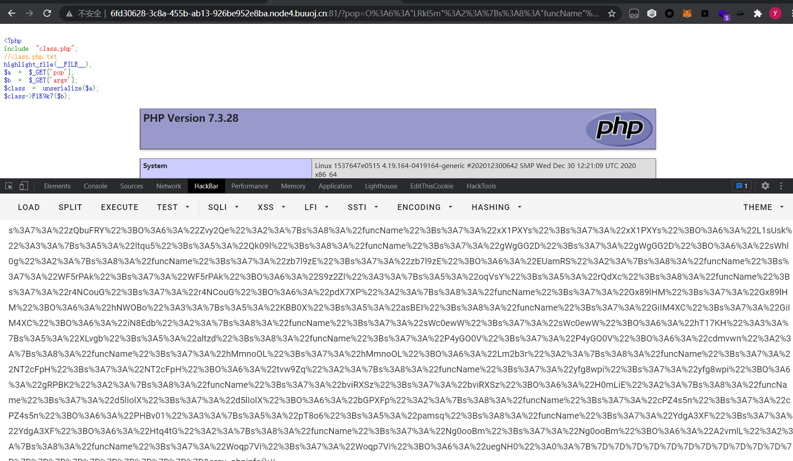

# pop_master-AutoPoP
强网杯十六万行代码自动生成POP链
## Description
利用PHP动态特性正向自动查找可利用的链路

## Usage

在generate.php中填写，类名与方法名，运行生成的final.php即可

```php
$className = "LRkI5m";
$classFuncName = "FlK9k7";
```


运行截图


